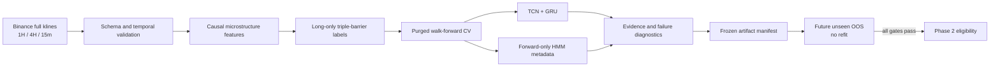

# yeniBot

[](#current-status)
[](#current-status)
[](https://github.com/umutergul74/yeniBot/actions/workflows/ci.yml)
[](requirements.txt)
[](yenibot/models/hybrid.py)

Bias-aware market-microstructure research for a long-only BTC/USDT
perpetual-futures sequence model.

`yeniBot` is a Phase 1 quantitative ML research system. It downloads full
Binance futures klines, constructs causal microstructure features, trains a
binary TCN+GRU model under purged walk-forward validation, and produces
artifact-verified evidence for or against promotion.

> [!IMPORTANT]
> This repository does not contain a trading bot, backtester, execution
> engine, position-sizing system, or live deployment service. Model scores are
> research outputs, not trading advice or calibrated probability estimates.

## Current Status

**Model evidence passes the active `v4_evidence` research charter. Phase 2 is
still blocked.**

The frozen primary candidate must complete a pre-registered future unseen
out-of-sample evaluation before any backtesting or execution work begins.

Latest reviewed evidence snapshot, generated from run `20260605_211102` and
reviewed on **June 10, 2026**:

| Evidence | Result | Interpretation |
|---|---:|---|
| Mean walk-forward Rank IC | `0.0734` | Passes the `0.03` gate |
| Positive-IC folds | `86.1%` | Broad, but not universal, fold support |
| PRAUC lift vs prevalence | `1.124` | Robust under hierarchical bootstrap |
| Precision lift vs prevalence | `1.101` | Positive point estimate; uncertainty remains |
| F1 skill vs rate-matched random | `+0.027` | Small but positive classification skill |
| Positive-return folds | `69.4%` | Passes the active consistency gate |
| Top-decile OOS forward return | `0.00317` | Positive walk-forward economic ordering |
| Raw probability calibration | Not deployment-ready | Use outputs as ranking scores |
| Fresh future-OOS rows | `253 / 720` | Promotion remains blocked |

The legacy monitors remain visible:

- Fold Rank IC standard deviation: `0.0708`
- Raw official Long F1: `0.4313`

These are not hidden or rewritten. Under the active evidence charter they are
monitors rather than standalone promotion gates because the original targets
did not account for dependent time-series sampling noise or no-skill class
baselines.

The current interpretation is deliberately narrow:

- The model has credible **ranking evidence**.
- The model does **not** yet have reliable probability calibration.
- The already-seen holdout produced a negative top-decile return and is not
  used for further tuning.
- Phase 2 requires the frozen candidate to pass fresh, no-refit future OOS.

## Research Boundary

### Implemented

- Binance USDT-M full-kline ingestion with Binance Vision fallback
- 1H primary, completed-and-shifted 4H context, and causal 15m intrahour inputs
- Strict raw schema, gap, duplicate, taker-volume, and trade-count validation
- Microstructure-first causal feature engineering
- Long-only binary triple-barrier labeling
- TCN+GRU binary sequence encoder
- Purged walk-forward cross-validation with train-only scaling
- Forward-only HMM regime metadata
- Versioned validation charters and append-only experiment memory
- Frozen candidate manifests with content-hashed artifacts
- Prediction-only future-OOS evaluation
- Slim/full evidence bundles and executive diagnostic dashboards

### Explicitly Not Implemented

- Backtesting
- Trade execution or exchange order routing
- Risk, leverage, or position management
- Live services or alerting
- Short-side or three-class labels
- XGBoost or other second-stage meta-learners
- Classical TA signal families such as RSI, MACD, or EMA crossovers

## Pipeline



## Leakage Controls

The repository treats leakage prevention as a first-class product feature.

- A 4H bar is shifted forward by exactly four hours before backward as-of
  merging, so incomplete higher-timeframe bars cannot reach 1H rows.
- Wavelet denoising uses rolling causal windows, never a full-series transform.
- Robust scalers are fitted independently on each training fold.
- Walk-forward folds include purge and embargo gaps.
- Validation, test, holdout, and future-OOS HMM inference is forward-only.
- Future-OOS scoring verifies model, scaler, HMM, feature-order, threshold, and
  training-signature hashes before prediction.
- Future-OOS performs zero fitting operations and fails closed on modified or
  unavailable artifacts.

## Model

The model receives sequences shaped `(batch, 64, n_features)`:

```text
TCN: causal dilated residual blocks [1, 2, 4, 8, 16]
GRU: 2 layers, hidden size 128, unidirectional
Fusion: concat(TCN_last, GRU_last) -> LayerNorm -> MLP
Output: one sigmoid score for the Long class
```

Training uses AdamW, focal loss, a rank-oriented auxiliary objective,
gradient clipping, cosine warm restarts, and early stopping on validation Rank
IC. All research settings are controlled by [`config.yaml`](config.yaml).

## Repository Layout

```text
yeniBot/
|-- config.yaml                 # Hyperparameters and research policy
|-- SKILLS.md                   # Phase 1 operational source of truth
|-- notebooks/                  # Colab workflow 01 through 05
|-- yenibot/
|   |-- data/                   # Download and raw-data validation
|   |-- features/               # Causal feature construction
|   |-- labeling/               # Long-only triple barrier
|   |-- models/                 # TCN and hybrid encoder
|   |-- training/               # Dataset, trainer, walk-forward CV
|   |-- regime/                 # Forward-only HMM
|   |-- experiment/             # Evidence, policy, freezing, orchestration
|   `-- automation/             # Report completeness and readiness review
|-- tests/                      # Unit and integration tests
|-- docs/                       # Architecture and reproducibility
`-- .github/                    # CI and research-aware contribution templates
```

See [`docs/architecture.md`](docs/architecture.md) for module ownership and
failure-localization rules.

Operational references:

- [`docs/current-status.md`](docs/current-status.md): frozen identity and
  current decision
- [`docs/future-oos-runbook.md`](docs/future-oos-runbook.md): exact no-refit
  evaluation procedure
- [`docs/metrics.md`](docs/metrics.md): metric definitions and estimands
- [`docs/experiment-history.md`](docs/experiment-history.md): retained lessons
  and rejected directions

## Colab Workflow

All production research notebooks run on Google Colab with source code from
GitHub and data/checkpoints stored on Google Drive.

Run in strict order:

1. [`01_data_preparation.ipynb`](notebooks/01_data_preparation.ipynb)
2. [`02_feature_engineering.ipynb`](notebooks/02_feature_engineering.ipynb)
3. [`03_labeling.ipynb`](notebooks/03_labeling.ipynb)
4. [`04_training_walk_forward.ipynb`](notebooks/04_training_walk_forward.ipynb)
5. [`05_diagnostics_validation.ipynb`](notebooks/05_diagnostics_validation.ipynb)

After every `git pull`, use **Runtime -> Restart session** before importing the
package again. Colab otherwise retains stale Python modules in memory.

Rerun rules:

| Change | Required notebooks |
|---|---|
| Raw-data range or source | `01 -> 02 -> 03`, then the needed downstream stage |
| Feature-generation formula | `02 -> 03 -> 04 -> 05` |
| Label semantics | `03 -> 04 -> 05` |
| Model, loss, training config, or active training profile | `04 -> 05` |
| Diagnostics/reporting only | `05` |
| Frozen future-OOS data refresh | `01 -> 02 -> 03 -> 05`; do not refit with `04` |

Before the frozen evaluation, follow
[`docs/future-oos-runbook.md`](docs/future-oos-runbook.md). Its preflight is
authoritative; a calendar date alone does not establish label readiness.

Notebook 05 writes a shareable slim archive under Google Drive:

```text
/content/drive/MyDrive/yeniBot/reports/phase1_latest_experiment_slim_bundle.zip
```

See [`docs/reproducibility.md`](docs/reproducibility.md) before reproducing or
reviewing an experiment.

## Local Development

```bash
git clone https://github.com/umutergul74/yeniBot.git
cd yeniBot

python -m venv .venv
python -m pip install --upgrade pip
python -m pip install -r requirements.txt

pytest -q
```

The package is research-oriented and notebook-driven; local tests use
synthetic fixtures and do not download market data.

## Evidence Artifacts

The diagnostics layer reports multiple estimands instead of compressing model
quality into one number:

- Fold-macro and pooled PRAUC/precision/F1 skill
- Hierarchical fold-cluster and moving-block uncertainty
- Rank IC sign tests, random-effects estimates, and block sensitivity
- Score-band label lift and realized forward returns
- Raw, Platt, and isotonic probability-quality audits
- Fold stability, score reversal, feature drift, and threshold-transfer audits
- Seed coverage and selected-profile completeness
- Frozen candidate hash verification and no-refit future-OOS evidence

Raw sigmoid outputs currently rank observations better than chance but are not
calibrated probabilities. Probability-based confidence language and
probability-sized positions are therefore out of scope.

## Research Governance

Before changing data, features, labels, training, diagnostics, or experiment
policy, read [`SKILLS.md`](SKILLS.md). It records:

- non-negotiable leakage rules
- rejected experiments that must not be repeated blindly
- the active validation charter
- holdout and future-OOS governance
- required diagnostic artifacts
- the Phase 1 to Phase 2 boundary

`config.yaml` is the machine-readable source for model settings, feature
profiles, experiment memory, evidence thresholds, and frozen candidates.
Historical failures are retained so the project advances cumulatively rather
than cycling through previously rejected ideas.

## Contributing

This is a research repository with unusually strict temporal-validity
requirements. Read [`CONTRIBUTING.md`](CONTRIBUTING.md) before opening a pull
request. Every research change must state its causal availability assumptions,
notebook rerun scope, and effect on frozen artifacts.

Security and responsible disclosure guidance is in
[`SECURITY.md`](SECURITY.md).

## License

No open-source license has been declared yet. Until the repository owner adds
one, the source remains available for review but no general reuse license is
granted.

## Disclaimer

This software is for research and educational purposes. It does not provide
investment advice, does not guarantee future performance, and is not ready for
live capital deployment.
