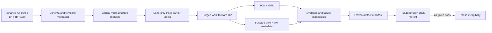

# yeniBot

[](#current-status)
[](#current-status)
[](https://github.com/umutergul74/yeniBot/actions/workflows/ci.yml)
[](requirements.txt)
[](yenibot/models/hybrid.py)

Bias-aware market-microstructure research for a long-only BTC/USDT
perpetual-futures sequence model.

`yeniBot` is a Phase 1 quantitative ML research system. It downloads full
Binance futures klines, constructs causal microstructure features, trains a
binary TCN+GRU model under purged walk-forward validation, and produces
artifact-verified evidence for or against promotion.

> [!IMPORTANT]
> This repository contains research backtesting and position sizing, but no
> order-routing bot or live deployment service. Model scores are
> research outputs, not trading advice or calibrated probability estimates.

## Current Status

Reviewed **August 30, 2026**, branch `codex/phase1-research-v2`.

- The retained TCN+GRU control has historical ranking evidence, not proven
  deployable profitability. Treat its sigmoid as a score, not calibrated odds.
- Both frozen Future-OOS candidates failed and are retired. Their original
  windows, predictions and outcomes must not be rescored or tuned.
- Adaptive expert selection and trajectory SWA failed their preregistered tests.
  SWA run `20260824_154330` is closed; training is explicitly paused in config.
- The current work is accounting/data integrity and economic-baseline review.
  No model, threshold, strategy or acceptance gate has been promoted.
- Phase 2 accounting `phase2_mtm_v2` uses hourly marked equity, explicit bar
  intervals, gap-aware stops, itemized fill costs and optional historical funding.
  Censored positions are not completed trades. Legacy forward locks are audit-only.
- Latest local raw snapshot: `data/raw/snapshots/20260830_integrity_v2`.
  No training, feature rebuild or OOS evaluation was run against this new data.

See [current status](docs/current-status.md) and
[integrity repair / next plan](docs/integrity-repair-plan.md) for limitations
and next actions. The current task is **not** to rerun Notebook 04/04a or to
wait for a retired candidate to pass.

## Research Boundary

### Implemented

- Binance USDT-M full-kline ingestion with Binance Vision fallback
- 1H primary, completed-and-shifted 4H context, and causal 15m intrahour inputs
- Strict raw schema, gap, duplicate, taker-volume, and trade-count validation
- Microstructure-first causal feature engineering
- Long-only binary triple-barrier labeling
- TCN+GRU binary sequence encoder
- Purged walk-forward cross-validation with train-only scaling
- Audited train-fold-only quantile clipping and feature reliability masking
- Forward-only HMM regime metadata
- Versioned validation charters and append-only experiment memory
- Frozen candidate manifests with content-hashed artifacts
- Prediction-only future-OOS evaluation
- Fail-closed Phase 2 sandbox backtesting and trade forensics
- Locked clean-forward candidates with fixed-fractional portfolio risk controls
- Slim/full evidence bundles and executive diagnostic dashboards

### Explicitly Not Implemented

- Trade execution or exchange order routing
- Live leverage or discretionary position management
- Live services or alerting
- Short-side or three-class labels
- XGBoost or other second-stage meta-learners
- Classical TA signal families such as RSI, MACD, or EMA crossovers

## Pipeline


```mermaid
flowchart LR
    A[Binance full klines<br/>1H / 4H / 15m] --> B[Schema and temporal validation]
    B --> C[Causal microstructure features]
    C --> D[Long-only triple-barrier labels]
    D --> E[Purged walk-forward CV]
    E --> F[TCN + GRU]
    E --> G[Forward-only HMM metadata]
    F --> H[Evidence and failure diagnostics]
    G --> H
    H --> I[Frozen artifact manifest]
    I --> J[Future unseen OOS<br/>no refit]
    J -->|all gates pass| K[Phase 2 eligibility]
```

## Leakage Controls

The repository treats leakage prevention as a first-class product feature.

- A 4H bar is shifted forward by exactly four hours before backward as-of
  merging, so incomplete higher-timeframe bars cannot reach 1H rows.
- Wavelet denoising uses rolling causal windows, never a full-series transform.
- Robust scalers are fitted independently on each training fold.
- Walk-forward folds include purge and embargo gaps.
- Validation, test, holdout, and future-OOS HMM inference is forward-only.
- Future-OOS scoring verifies model, scaler, HMM, feature-order, threshold, and
  training-signature hashes before prediction.
- Future-OOS performs zero fitting operations and fails closed on modified or
  unavailable artifacts.

## Model

The model receives sequences shaped `(batch, 64, n_features)`:

```text
TCN: causal dilated residual blocks [1, 2, 4, 8, 16]
GRU: 2 layers, hidden size 128, unidirectional
Fusion: concat(TCN_last, GRU_last) -> LayerNorm -> MLP
Output: one sigmoid score for the Long class
```

Training uses AdamW, focal loss, a rank-oriented auxiliary objective,
gradient clipping, cosine warm restarts, and early stopping on validation Rank
IC. All research settings are controlled by [`config.yaml`](config.yaml).

## Repository Layout

```text
yeniBot/
|-- config.yaml                 # Hyperparameters and research policy
|-- SKILLS.md                   # Phase 1 operational source of truth
|-- notebooks/                  # Colab workflow 01 through 05
|-- yenibot/
|   |-- data/                   # Download and raw-data validation
|   |-- features/               # Causal feature construction
|   |-- labeling/               # Long-only triple barrier
|   |-- models/                 # TCN and hybrid encoder
|   |-- training/               # Dataset, trainer, walk-forward CV
|   |-- regime/                 # Forward-only HMM
|   |-- experiment/             # Evidence, policy, freezing, orchestration
|   `-- automation/             # Report completeness and readiness review
|-- tests/                      # Unit and integration tests
|-- docs/                       # Architecture and reproducibility
`-- .github/                    # CI and research-aware contribution templates
```

See [`docs/architecture.md`](docs/architecture.md) for module ownership and
failure-localization rules.

Operational references:

- [`docs/current-status.md`](docs/current-status.md): frozen identity and
  current decision
- [`docs/future-oos-runbook.md`](docs/future-oos-runbook.md): exact no-refit
  evaluation procedure
- [`docs/metrics.md`](docs/metrics.md): metric definitions and estimands
- [`docs/experiment-history.md`](docs/experiment-history.md): retained lessons
  and rejected directions
- [`docs/phase2-design.md`](docs/phase2-design.md): frozen Phase 2 research
  backtest contract
- [`docs/phase2-entry-checklist.md`](docs/phase2-entry-checklist.md): blocking
  entry conditions before implementation
- [`docs/phase2-economic-attribution.md`](docs/phase2-economic-attribution.md):
  model-vs-filter economic contribution audit and current findings

## Colab Workflow

All production research notebooks run on Google Colab with source code from
GitHub and data/checkpoints stored on Google Drive.

The current Phase 1/Phase 2 sandbox workflow is isolated on
`codex/phase1-research-v2`. Every notebook fetches, checks out, and verifies
that branch by default, then prints the exact commit. Override
`YENIBOT_REPO_BRANCH` only for a deliberate reviewed run.

Run in strict order:

1. [`01_data_preparation.ipynb`](notebooks/01_data_preparation.ipynb)
2. [`02_feature_engineering.ipynb`](notebooks/02_feature_engineering.ipynb)
3. [`03_labeling.ipynb`](notebooks/03_labeling.ipynb)
4. [`04_training_walk_forward.ipynb`](notebooks/04_training_walk_forward.ipynb)
5. [`04a_phase1_adaptive_ensemble_research.ipynb`](notebooks/04a_phase1_adaptive_ensemble_research.ipynb), only when its exact cached-policy hypothesis is active
6. [`05_diagnostics_validation.ipynb`](notebooks/05_diagnostics_validation.ipynb)
7. [`06_phase2_sandbox_backtest.ipynb`](notebooks/06_phase2_sandbox_backtest.ipynb)
8. [`07_phase2_clean_forward_confirmation.ipynb`](notebooks/07_phase2_clean_forward_confirmation.ipynb)
9. [`08_phase2_forward_shadow_v2.ipynb`](notebooks/08_phase2_forward_shadow_v2.ipynb)

After every `git pull`, use **Runtime -> Restart session** before importing the
package again. Colab otherwise retains stale Python modules in memory.

Rerun rules (future work requires an approved active research contract; training is currently paused):

| Change | Required notebooks |
|---|---|
| Raw-data range or source | `01 -> 02 -> 03`, then the needed downstream stage |
| Feature-generation formula | `02 -> 03 -> 04 -> 05` |
| Label semantics | `03 -> 04 -> 05` |
| Model, loss, training config, or active training profile | `04 -> 05` |
| Diagnostics/reporting only | `05` |
| Frozen-prediction Phase 2 sandbox/backtest only | `06`; no training and no Phase 1 report rebuild |
| Locked clean-forward confirmation | `07` only with a new valid lock and separate append-only predictions; current lock is audit-only |
| Unevaluated frozen future-OOS data refresh | `01 -> 02 -> 03 -> 05`; do not refit with `04` |
| Historical walk-forward preprocessing/profile experiment | `04 -> 05`; notebooks `02/03` are unchanged |
| Closed trajectory-SWA experiment | No rerun; retained as historical audit evidence |

When `candidate_profiles` is empty, do not run notebook `04` merely to recreate
the control. Use notebook `05` for reporting changes and wait until a distinct
candidate is explicitly pre-registered.

Notebook 04a is retained only for the completed cached-policy audit and is not
part of the active run. Trajectory SWA is also closed. Do not rerun 04/04a
to reproduce rejected candidates. A new experiment requires reviewed
preregistration and explicit re-enabling of training in config.

Before any unevaluated frozen-candidate evaluation, follow
[`docs/future-oos-runbook.md`](docs/future-oos-runbook.md). Its preflight is
authoritative; a calendar date alone does not establish label readiness.

Notebook 05 writes a shareable slim archive under Google Drive:

```text
/content/drive/MyDrive/yeniBot/reports/phase1_latest_experiment_slim_bundle.zip
```

Notebook 06 is the fast, independent Phase 2 entry point. It consumes the
already-pinned prediction artifact, runs no fit operation, executes the
pre-registered optimistic/base/adverse cost scenarios, produces fold/month/
exit/score/holding forensics, and evaluates a bounded dynamic-exit family
without automatically selecting a winner. It writes:

```text
/content/drive/MyDrive/yeniBot/reports/phase2_latest_sandbox_bundle.zip
```

Notebook 07 is the immutable clean-forward evaluator. It uses only post-anchor
Future-OOS predictions from Notebook 05, applies the committed candidate and
risk lock, and refuses to select or promote automatically. See
[`docs/phase2-forward-confirmation.md`](docs/phase2-forward-confirmation.md).

See [`docs/reproducibility.md`](docs/reproducibility.md) before reproducing or
reviewing an experiment.

## Local Development

```bash
git clone https://github.com/umutergul74/yeniBot.git
cd yeniBot

python -m venv .venv
python -m pip install --upgrade pip
python -m pip install -r requirements.txt

pytest -q
```

The package is research-oriented and notebook-driven; local tests use
synthetic fixtures and do not download market data.

## Evidence Artifacts

The diagnostics layer reports multiple estimands instead of compressing model
quality into one number:

- Fold-macro and pooled PRAUC/precision/F1 skill
- Hierarchical fold-cluster and moving-block uncertainty
- Rank IC sign tests, random-effects estimates, and block sensitivity
- Score-band label lift and realized forward returns
- Raw, Platt, and isotonic probability-quality audits
- Fold stability, score reversal, feature drift, and threshold-transfer audits
- Seed coverage and selected-profile completeness
- Frozen candidate hash verification and no-refit future-OOS evidence

Raw sigmoid outputs currently rank observations better than chance but are not
calibrated probabilities. Probability-based confidence language and
probability-sized positions are therefore out of scope.

## Research Governance

Before changing data, features, labels, training, diagnostics, or experiment
policy, read [`SKILLS.md`](SKILLS.md). It records:

- non-negotiable leakage rules
- rejected experiments that must not be repeated blindly
- the active validation charter
- holdout and future-OOS governance
- required diagnostic artifacts
- the Phase 1 to Phase 2 boundary

`config.yaml` is the machine-readable source for model settings, feature
profiles, experiment memory, evidence thresholds, and frozen candidates.
Historical failures are retained so the project advances cumulatively rather
than cycling through previously rejected ideas.

## Contributing

This is a research repository with unusually strict temporal-validity
requirements. Read [`CONTRIBUTING.md`](CONTRIBUTING.md) before opening a pull
request. Every research change must state its causal availability assumptions,
notebook rerun scope, and effect on frozen artifacts.

Security and responsible disclosure guidance is in
[`SECURITY.md`](SECURITY.md).

## License

No open-source license has been declared yet. Until the repository owner adds
one, the source remains available for review but no general reuse license is
granted.

## Disclaimer

This software is for research and educational purposes. It does not provide
investment advice, does not guarantee future performance, and is not ready for
live capital deployment.
